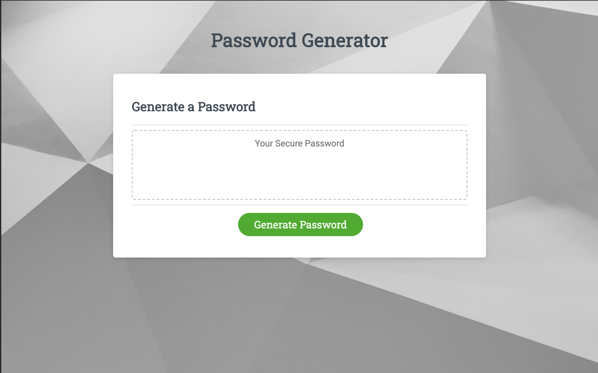
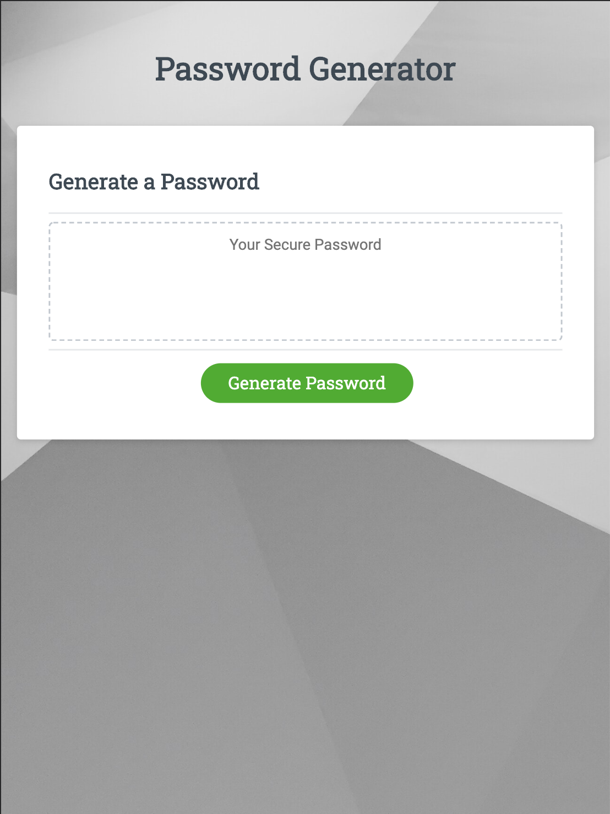
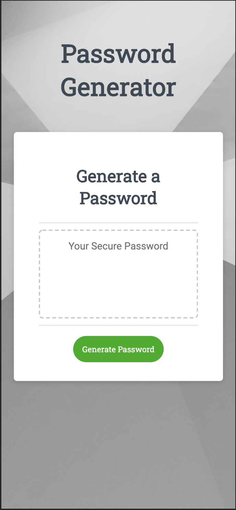

# Password Generator

Link to published page:https://keycole.github.io/password-generator/

## Purpose

This app generates a random password from 8 - 128 characters. 
The user can select the length and whether to include uppercase, lowercase, numeric, and/or special characters.

## Built With

1. HTML, CSS, JS

1. Assets:
* Background image from https://unsplash.com/
* Favicon from https://favicon.io/

## Screenshots

**Desktop**

**Tablet**

**Mobile**

